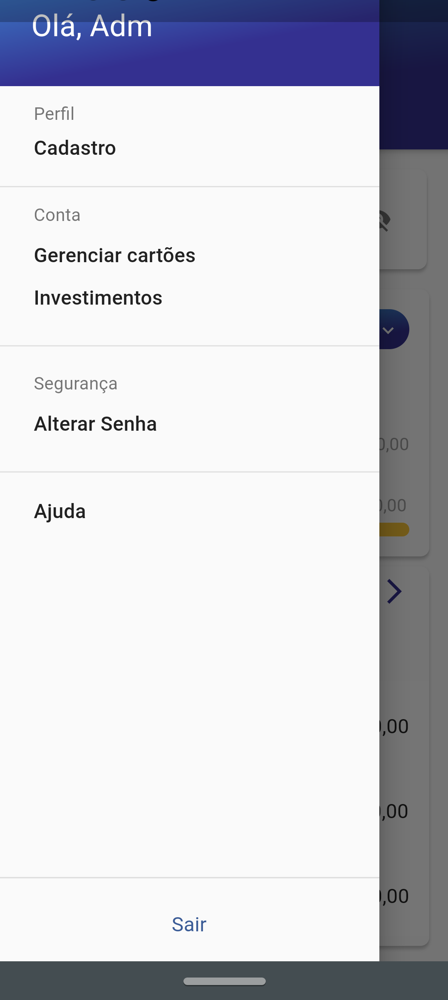

# Bugdet | Raro Academy
#### _Aplicativo de gerenciamento de finanças criado para o trabalho final de conclusão do curso de Flutter da Raro Academy_

### Integrantes da SQUAD 
> [Airton Sousa](https://github.com/notria-12), [Gustavo Silva](https://github.com/guusta7), [Kaio C. de Oliveira](https://github.com/devkaio) e [Lucas Tamir Faria](https://github.com/tamirfaria)

### Sobre o App
>O aplicativo foi criado com base no layout apresentado durante as semanas finais do Raro Academy, e utilizamos em sua construção o Flutter para criação das telas e suas respectivas lógicas, e o Firebase para o armazenamento de dados como as informações do usuário, e as finanças inseridas.

### Resultado





### Instalando as dependências

- Clone o repositório;

- Abra a pasta com seu IDE e atualize instale as dependências com _'flutter pub get'_;
```
flutter pub get
```
- Após atualizado, escolha onde o aplicativo será debugado (smartphone ou emulador) e realize o debug;

- O aplicativo será instalado no respectivo dispositivo e a partir daí é só utilizá-lo.
